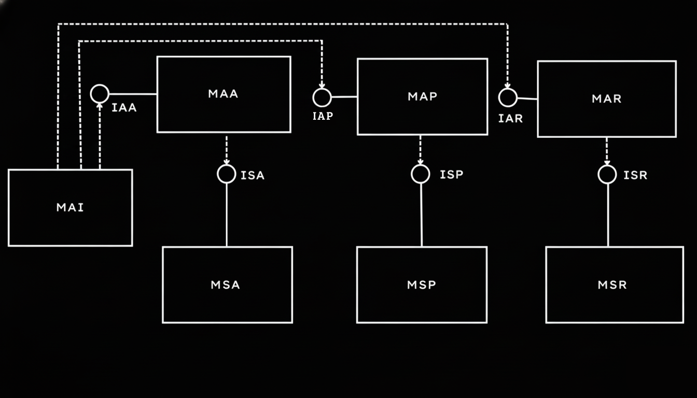

# Hotel Management System

A robust **C++ application** designed for hotel administration, featuring a **Layered Architecture** that strictly separates user interaction from business logic and data persistence.

This project was developed to implement advanced **Object-Oriented Programming** concepts, focusing on **modularity**, **decoupling**, and **industry-standard build systems**.

---

## 📖 About the Project

The **Hotel Management System** provides a comprehensive solution for managing typical hospitality operations. It allows managers to handle:

* User authentication
* Guest profiles
* Room inventory
* Reservation scheduling

All while ensuring **data integrity** and preventing **booking conflicts**.

The core engineering goal was to implement a **Service-Oriented Architecture**, where the **Presentation Layer** communicates with the **Service Layer** strictly through **abstract interfaces**, ensuring high modularity and testability.

---

## 🏗 Architecture

The system is organized into two main layers that communicate via well-defined interfaces:

### 1. Presentation Layer

Responsible for user interaction and data validation. It acts as a client to the service layer.




* **MAI (Access Interface Module)**  
  Acts as the central hub, routing the user to authentication, personal profile, or reservation modules.

* **MAA (Authentication Presentation)**  
  Handles login and registration UI.

* **MAP (Personal Presentation)**  
  Manages user profile updates.

* **MAR (Reservation Presentation)**  
  The operational core for CRUD operations on **Hotels**, **Rooms**, and **Reservations**.

### 2. Service Layer

Responsible for business logic, rules enforcement, and data persistence.

* **MSA (Authentication Service)**  
  Validates credentials and manages session tokens.

* **MSP (Personal Service)**  
  Ensures data integrity for user profiles.

* **MSR (Reservation Service)**  
  Validates business rules (e.g., date conflicts, capacity checks) and executes transactions.

---

## 📂 Project Structure

The project follows a standard C++ directory layout:

```text
Hotel-Management-System/
├── docs/html/               # Documentation and diagrams
│
├── include/                 # Header files (.hpp) defining contracts and abstractions
│   ├── containers.hpp       # Data containers and repository-like structures
│   ├── domains.hpp          # Domain rules, validations, and business logic definitions
│   ├── entities.hpp         # Core domain entities (Hotel, Room, Reservation, etc.)
│   ├── interfaces.hpp       # Interfaces and contracts between system layers
│   ├── presentation.hpp     # Presentation layer definitions (CLI / UI interfaces)
│   └── services.hpp         # Application services coordinating domain operations
│
├── src/                     # Source files (.cpp) implementing system logic
│   ├── containers.cpp       # Implementations of data containers and repositories
│   ├── domains.cpp          # Implementations of domain rules and business logic
│   ├── presentation.cpp     # User interface and input/output handling
│   └── services.cpp         # Implementations of application services
│
├── .gitignore               
├── CMakeLists.txt           # CMake build configuration
├── Doxyfile                 # Doxygen configuration file
├── README.md                
└── main.cpp                 # Application entry point
```

---

## ✨ Key Features

* **Authentication**  
  Secure login and account creation for managers.

* **CRUD Operations**  
  Full management of **Hotels**, **Rooms**, **Guests**, and **Reservations**.

* **Business Logic Enforcement**

  * Prevention of conflicting reservation dates
  * Validation of domain types (e.g., Credit Card **Luhn algorithm**, Email format)

* **Custom Persistence**  
  Implemented using custom container structures for in-memory data management.

---

## 🛠 Technologies

* **Language:** C++17
* **Build System:** CMake
* **Documentation:** Doxygen
* **IDE Support:**

  * VS Code (configured with CMake Tools)
  * Code::Blocks (legacy support)

---

## 🚀 Getting Started

### Prerequisites

* C++ Compiler (GCC recommended)
* CMake (version **3.10** or higher)

### Building and Running (Linux/macOS)

1. **Clone the repository**

```bash
git clone https://github.com/YOUR-USERNAME/HotelManagementSystem.git
cd HotelManagementSystem
```

2. **Build the project**

```bash
mkdir build
cd build
cmake ..
make
```

3. **Run the application**

```bash
./HotelSystem
```

---

## 📝 Note on Language

While the interface, documentation, and file structure are in **English** to adhere to global development standards, the internal domain logic (variable names, class names, and UI text) remains in **Portuguese (PT-BR)**.

This decision preserves the original domain language of the stakeholders and requirements for whom the software was initially designed.

---

## 📄 License

This project is **open-source** and available for **educational purposes**.

Developed by **Gustavo Pavanelli** and **Maria Eduarda Vidal**